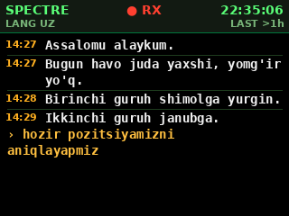
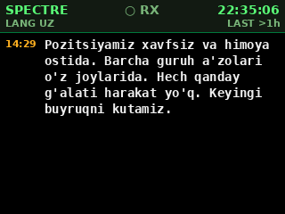
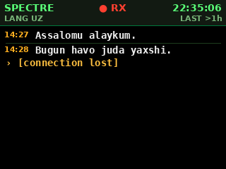
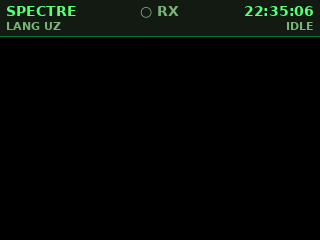

# Spectre

**Tactical STT module: radio audio → real-time Uzbek text → wrist-mounted ILI9341 TFT.**

Captures audio from a Hytera PD785G (via a USB sound card) on a Raspberry Pi 4,
streams it to **ElevenLabs Scribe v2 Realtime** for Uzbek transcription, and
paints the transcript onto a 3.2" SPI TFT in landscape — so the operator reads
instead of listens.

- Latency: ~150–400 ms to the first partial transcript
- Accuracy: ~3.1% WER on FLEURS Uzbek (best in class, see table below)
- Hardware: Raspberry Pi 4 (2 GB), USB audio card, ILI9341 320×240 over SPI
- Footprint: ~120 MB RSS, one process, three asyncio tasks

## What the HUD looks like

Rendered directly by `spectre.display.paint_frame` — the same function runs
on the real TFT, so these screenshots are pixel-identical to what the
operator sees.






Top bar: **SPECTRE** title · `● RX` indicator (red while a partial is live) · live
clock · language · seconds since the last committed line.
Body: amber `HH:MM` gutter · white transcript · amber live partial with `›`
marker · thin separator between transmissions.

## Architecture

```
          USB sound card                 WebSocket (wss://api.elevenlabs.io)
Hytera ──▶ ALSA capture ──▶ 16 kHz      ◀─────────── partial/committed
radio      plughw:1,0       PCM mono       transcripts
                │                │
                ▼                ▼
       asyncio.Queue[bytes]  ┌──────────────────┐
                │            │  ScribeStream    │
                └──────────▶ │  (elevenlabs SDK)│
                             └────────┬─────────┘
                                      ▼
                              asyncio.Queue[Transcript]
                                      ▼
                              ┌───────────────────────┐
                              │ TextBuffer →          │
                              │ paint_frame →         │
                              │ ILI9341 / Console     │
                              └───────────────────────┘
```

Three asyncio tasks, one event loop, one process.  Audio capture runs in a
worker thread and pushes onto an `asyncio.Queue`; the event loop itself never
blocks on I/O.

## Why Scribe v2 Realtime?

Published WER on the FLEURS Uzbek benchmark (source:
[ElevenLabs](https://elevenlabs.io/speech-to-text/uzbek)):

| Model                             | FLEURS Uzbek WER |
|-----------------------------------|------------------|
| **ElevenLabs Scribe v2 Realtime** | **~3.1%**        |
| ElevenLabs Scribe v1              | 15.9%            |
| Google Gemini Flash 2             | 32.0%            |
| Whisper Large v3 (base)           | 96.7%            |
| Deepgram Nova 2                   | unsupported      |

Whisper without fine-tuning is effectively broken on Uzbek.  The community
`whisper-medium-uz` fine-tune gets ~38% WER on Common Voice — still an order
of magnitude worse than Scribe.  Scribe v2 Realtime also does proper
server-side streaming with VAD, which Whisper does not.

Verified live with a short English + Uzbek smoke test on 2025-04-23; partial
and final transcripts arrive in the expected format.

## Install on a Raspberry Pi 4

Tested on Raspberry Pi OS Bookworm (64-bit).  As the `pi` user:

```bash
git clone <your-repo> Spectre && cd Spectre   # or extract the tarball
./scripts/install.sh
```

The installer is idempotent and:
1. Installs apt packages (`libportaudio2`, `python3-venv`, GPIO/SPI bindings, DejaVu fonts)
2. Enables the SPI interface in `/boot/firmware/config.txt`
3. Rsyncs the tree into `/opt/spectre`
4. Creates a venv at `/opt/spectre/.venv` and `pip install`s Spectre
5. Drops `spectre.service` into `/etc/systemd/system` and reloads systemd

For a **deployed field unit** where the TFT must *only* show Spectre — no
desktop falling back onto it when the HDMI is unplugged — add `--kiosk`:

```bash
./scripts/install.sh --kiosk
```

This additionally:
- Sets the default systemd target to `multi-user.target` (boot to console, no X desktop)
- Disables LightDM / GDM if present
- Disables `fbcp` / `fbcp-ili9341` framebuffer-mirror services
- Comments out any `dtoverlay=tft/fbtft/ili9341/rpi-display/waveshare` line in
  `config.txt` (backs up the file as `config.txt.spectre.bak`) so the kernel
  doesn't bind the TFT as `/dev/fb1` and fight luma.lcd for the SPI bus
- Leaves SSH enabled so you can still `ssh pi@<host>` to manage the unit

After `--kiosk`, **reboot once** — then the Pi comes up with Spectre on the
TFT whether HDMI is plugged in or not.  HDMI, when connected, shows the
normal text login; to poke around use `ssh` or plug in a keyboard.

The installer **enables the service automatically** — from this point on,
Spectre starts on every Pi boot without any extra commands.  As soon as the
Pi powers on the TFT lights up with the status bar, `connecting…` flashes
briefly, and then live transcripts begin appearing.

If you haven't set `ELEVENLABS_API_KEY` yet, the TFT will show
**`NO API KEY — configure .env`** instead.  Fix it:

```bash
sudo -e /opt/spectre/.env              # set ELEVENLABS_API_KEY, audio device
sudo systemctl restart spectre         # pick up the new .env
journalctl -fu spectre                 # tail the service logs
```

On the very next reboot (and every reboot thereafter) Spectre comes up
automatically — no login, no manual commands.

## First-time audio setup

1. Plug the USB sound card in, then:
   ```bash
   arecord -l
   ```
   Note the **card** and **device** numbers (e.g. `card 1: Device ..., device 0`).
2. Set `SPECTRE_AUDIO_DEVICE=plughw:1,0` in `/opt/spectre/.env`.
3. Run the diagnostic:
   ```bash
   /opt/spectre/scripts/test_mic.sh
   ```
   Press PTT on the radio during the 3-second capture; you should see non-zero
   peak levels and hear playback.

If the signal is too quiet, raise `SPECTRE_AUDIO_GAIN` (default 1.5; 2.5–3.0 is
typical for the Hytera AUX line).  Too hot → lower it.

## Getting an ElevenLabs API key

1. Sign up / log in at <https://elevenlabs.io/app/sign-in>.
2. **Profile → API Keys → Create API Key.**
3. Grant the key at minimum `speech_to_text` access.
4. Paste it into `/opt/spectre/.env` as `ELEVENLABS_API_KEY=...`.

Realtime STT concurrency is 6 on the Free tier and 15 on Creator — one stream
per radio is plenty.

## Develop on a laptop (no Pi, no radio)

Spectre runs headlessly on any Linux box with PortAudio:

```bash
python3 -m venv .venv && source .venv/bin/activate
pip install -e ".[dev]"
cp .env.example .env
echo "ELEVENLABS_API_KEY=sk_..." >> .env
echo "SPECTRE_DISPLAY=console"   >> .env

# Replay a WAV file through the real API:
spectre --wav path/to/uz_sample.wav

# Fully offline unit tests (no API, no audio):
pytest -q
ruff check src tests
```

`SPECTRE_DRY_RUN=1` plus `SPECTRE_DISPLAY=console` lets you exercise the
renderer and config layer without touching the network or hardware.

## Regenerating the mockups

`scripts/render_mocks.py` produces the PNGs in `docs/screenshots/` by calling
the real `paint_frame` used on the TFT.  If you change colours or layout in
`spectre.display`, re-run it:

```bash
python scripts/render_mocks.py
```

## Hardware wiring

See [`docs/wiring.md`](docs/wiring.md) for the full pinout of the ILI9341 and
the USB audio path.

## Configuration

All runtime knobs are read from environment variables (see
[`.env.example`](.env.example) for the full list):

| Variable                       | Default      | What it does                              |
|--------------------------------|--------------|-------------------------------------------|
| `ELEVENLABS_API_KEY`           | —            | **Required.**                             |
| `SPECTRE_LANGUAGE`             | `uz`         | BCP-47 style language code                |
| `SPECTRE_AUDIO_DEVICE`         | `default`    | ALSA device string (e.g. `plughw:1,0`)    |
| `SPECTRE_AUDIO_GAIN`           | `1.5`        | digital gain applied to the raw PCM       |
| `SPECTRE_VAD_SILENCE_SEC`      | `0.6`        | silence needed to finalise a segment      |
| `SPECTRE_VAD_THRESHOLD`        | `0.4`        | VAD sensitivity (0.1–0.9)                 |
| `SPECTRE_DISPLAY`              | `ili9341`    | `ili9341` or `console`                    |
| `SPECTRE_GPIO_DC` / `_RST`     | `24` / `25`  | BCM GPIOs for data/command + reset        |
| `SPECTRE_DISPLAY_ROTATE`       | `1`          | `1` = landscape; `3` = landscape flipped  |
| `SPECTRE_BUFFER_WORDS`         | `120`        | how much transcript history to keep       |
| `SPECTRE_DRY_RUN`              | `0`          | `1` skips the API (for tests)             |

## Troubleshooting

- **`libportaudio is not installed`** → `sudo apt install libportaudio2`.
- **`Could not open ALSA device 'plughw:1,0'`** → run `arecord -l`, pick the
  right `card,device` pair, update `SPECTRE_AUDIO_DEVICE`.
- **Display stays blank** → confirm `/dev/spidev0.0` exists, `dtparam=spi=on`
  is in `/boot/firmware/config.txt`, and that the GPIO DC/RST pins in `.env`
  match how you wired the ribbon.
- **Display upside-down** → set `SPECTRE_DISPLAY_ROTATE=3`.
- **`[connection lost]` flashing on the screen** → network problem.  Spectre
  reconnects automatically with exponential backoff (1 s → 30 s).
- **`AUTH_ERROR`** → bad API key, or it lacks `speech_to_text` permission.
- **`QUOTA_EXCEEDED`** → free tier of ElevenLabs has a monthly character cap;
  upgrade the plan or swap the API key.
- **Text too small / too big** → edit `BODY_WIDTH_CHARS`, `BODY_HEIGHT_LINES`,
  and the font sizes inside `src/spectre/display.py` — the offline mock-ups
  will immediately reflect the change.

## Project layout

```
src/spectre/
  audio.py        # PortAudio capture + WAV replay
  stt.py          # ElevenLabs Scribe v2 Realtime client
  renderer.py     # pure text-layout + HUD data model (headless, 16 tests)
  display.py      # Pillow painter + ILI9341 + Console backends
  config.py       # .env / os.environ parsing, validation
  logging_setup.py
  main.py         # asyncio orchestrator + CLI
scripts/
  install.sh      # one-shot Pi installer
  test_mic.sh     # arecord + sox level check
  render_mocks.py # regenerate docs/screenshots/*.png
systemd/
  spectre.service # Type=simple, MemoryMax=400M, Restart=on-failure
tests/            # 16 offline tests (renderer, config, WAV iterator)
docs/
  wiring.md
  screenshots/    # pixel-identical to what the TFT shows
```

## License

MIT — see [`LICENSE`](LICENSE).
